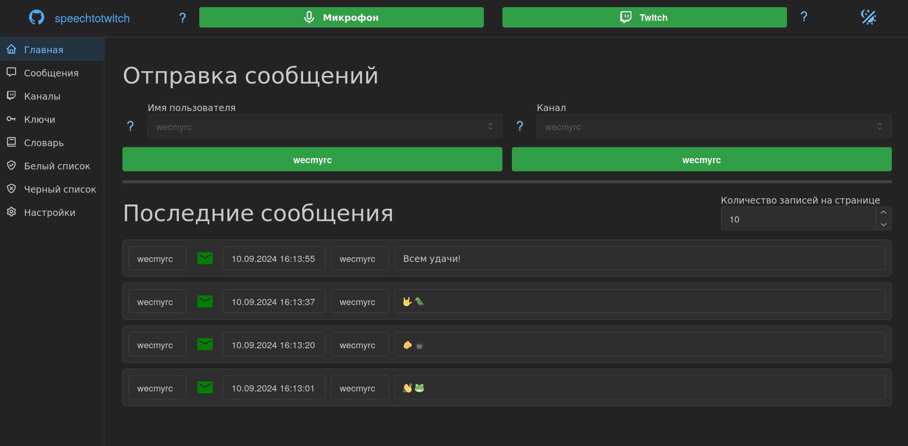

# Speech to twitch

Распознавание речи и отправка в чат канала twitch

Особенности:

 - Web-GUI на основе [Flask](https://flask.palletsprojects.com/en/3.0.x/), [Dash](https://dash.plotly.com/) и [DMC](https://www.dash-mantine-components.com/)
 - Оффлайн распознование речи с использованием [vosk](https://alphacephei.com/vosk/)
 - Все данные хранятся локально в базе данных [sqlite](https://www.sqlite.org/)
 - Возможность быстрого переключения между пользователями и каналами
 - Хранение всех отправленных сообщений
 - Наличие словаря, белого и черного списков



## Зависимости

 - [python >=3.12, <4.0](https://www.python.org/downloads/)
 - [poetry >=1.8.3](https://python-poetry.org/)
 - [(linux) nix >=2.18.5](https://nixos.org/download/)

## Запуск

Страница программы находится по адресу [http://127.0.0.1:8050/](http://127.0.0.1:8050/).

### Windows

Управлением зависимостями и запуском занимается [poetry](https://python-poetry.org/). После [установки poetry](https://python-poetry.org/docs/) и скачивания [последней версии speechtotwitch](https://github.com/wecmyrc/speechtotwitch/releases/latest) перейди в папку с исходным кодом и выполни следующие команды:

```
poetry install
poetry run stt
```

или запусти файл `stt_win.bat`, который содержит эти команды

### Linux

Для сборки под linux, помимо [poetry](https://python-poetry.org/), необходим [nix](https://nixos.org/download/). Скачай [последнюю версию speechtotwitch](https://github.com/wecmyrc/speechtotwitch/releases/latest), перейди в папку с исходным кодом и выполни следующию команду:

```
nix --extra-experimental-features flakes run
```

или если включены [flakes](https://wiki.nixos.org/wiki/Flakes) то:

```
nix run
```

Также можно запустить без скачивания архива с исходным кодом:

```
nix --extra-experimental-features flakes run github:wecmyrc/speechtotwitch
```

или

```
nix run github:wecmyrc/speechtotwitch
```

## База данных

База данных [sqlite](https://www.sqlite.org/) хранит локально все данные программы (пользователи, каналы, настройки и т.д.). Учти что база данных не защищена шифрованием. В зависимости от ОС база данных хранится в разных местах:

- Windows: `/db/stt.db` в папке с исходным кодом
- Linux: `~/.stt/stt.db`

## Логи

Если что-то пошло не так, то информация об ошибке содержится в файле `stt.log`:

- Windows: `/base_logger/stt.log` в папке с исходным кодом
- Linux: `~/.stt/stt.log`
